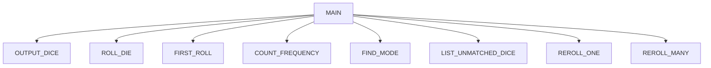

# Chapter 7 Team Project
Gage Boyd, Owen Schroeder, Landon Pfannenstiel

## Chapter 7 Team Project
The program generates 12 random nubmers, finds the most common number and rerolls all other
numbers until they match the mode.

### Chapter 5 Team Project Flowchart

#### Function Diagrams

| `main`             |               |  Gage     |
| ------------------ | ------------- | ------------ |
| ` no arguments`    | calls functions and manages variables, outputs who wins or if they lost.  |`calls display_menu`|
***
| `display_menu`    |               |    Gage  |
| ------------------ | ------------- | ------------ |
| `no arguments`    | takes input from the user for choice  | `returns choice`|
***
| `names`| | Max|
| ------------------ | ------------- | ------------ |
|`no arguments`| asks for players names | `returns name1 and name2`|
***
| `number`| | Gage|
| ------------------ | ------------- | ------------ |
| ` no arguments`| generates a random number from 1 - 1000| `returns randomNumber`|
***
| `guessing`| | Max | 
| ------------------ | ------------- | ------------ |
| `name1:string, name2:string, randomNumber:int` | asks players to guess the number | `returns winner:string, turns:int`|
