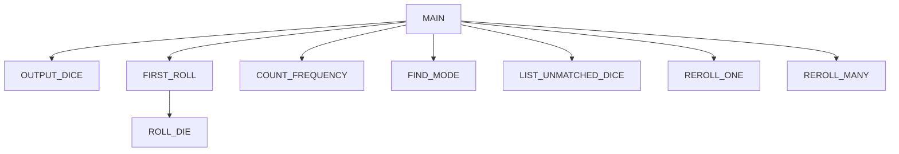

# Chapter 7 Team Project
Gage Boyd, Owen Schroeder, Landon Pfannenstiel

## Chapter 7 Team Project
The program generates 12 random nubmers, finds the most common number and rerolls all other
numbers until they match the mode.

### Chapter 7 Team Project Flowchart

#### Function Diagrams

| `main`             |               |  Landon     |
| ------------------ | ------------- | ------------ |
| `no arguments`    | Calls the functions to play the number of games specified |`calls first_roll`|
***
| `output_dice`    |               |    Gage  |
| ------------------ | ------------- | ------------ |
| `recieves an argument for dice`    | Ouputs the number of dice in the list  | `returns nothing`|
***
| `roll_die`| | Owen|
| ------------------ | ------------- | ------------ |
|`no arguments`| Rolls a number from 1-6 | `returns the roll`|
***
| `first_roll`| | Owen|
| ------------------ | ------------- | ------------ |
| `no arguments`| Uses roll die to roll 12 random numbers | `returns 12 random numbers`|
***
| `count_frequency`| | Owen | 
| ------------------ | ------------- | ------------ |
| `recieves an argument for dice,number` | Accepts a target number and the list of 12, counts the frequency of the number. | `returns the amount_occured`|
***
| `find_mode`| | Landon | 
| ------------------ | ------------- | ------------ |
| `recieves an argument for the list of dice` | Uses count frequency to find the amount each time a number occurs. | `returns the mode`|
***
| `list_unmatched_dice`| | Landon | 
| ------------------ | ------------- | ------------ |
| `Accepts a list of dice` | Finds which dice needs rerolled and returns the indexes of it. | `returns the indexes that need rerolled`|
***
| `reroll_one`| | Gage | 
| ------------------ | ------------- | ------------ |
| `Accepts a list of dice, and an index` | Uses roll_die to roll a die to reroll that index.| `returns a new list with the index rerolled`|
***
| `reroll_many`| | Gage | 
| ------------------ | ------------- | ------------ |
| `Accepts a list of dice` | Calls find_mode, list_unmatched_dice, and reroll_one to reroll each die != to the mode | `returns the list of re-rolled dice.`|
